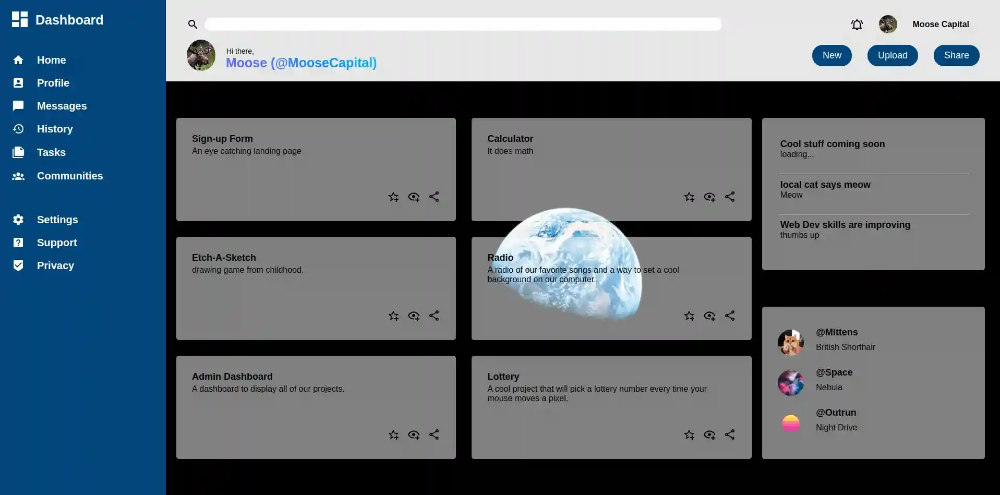

<h1 style="text-align: center;">Admin Dashboard</h1>
  
  
 

 

>  An admin dashboard to practice css grid
>  
>  This project is from [The Odin Project](https://www.theodinproject.com/lessons/node-path-intermediate-html-and-css-admin-dashboard)

 
Originally created 6/4/22

